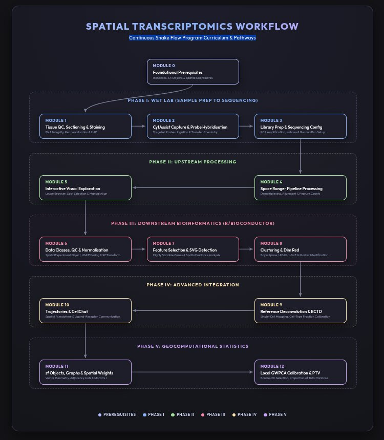

# Spatial Transcriptomics: Wet Lab to Geocomputational Modeling
## An End-to-End Curriculum, Extraction Guide, and Bioinformatics Reference Manual

This repository contains a comprehensive, step-by-step curriculum and practical study guide covering the complete lifecycle of Spatial Transcriptomics (STx). The course bridges the gap between wet-lab sample preparation, upstream data processing, downstream R/Bioconductor bioinformatics, and advanced geocomputational spatial modeling.

---

## 🗺️ Program Workflow Overview (To be changed!)

The program covers five key phases (comprising Modules 0 to 12) from tissue sectioning to advanced local spatial statistics.



---

## 📂 Repository Directory Structure

```
.
├── assets/                  # Visualization assets and curriculum diagrams
│   ├── workflow_diagram.jpg # Visual map of the complete pipeline
│   └── phase0.jpg - phase5.jpg # Phase-specific illustration graphics
│
├── docs/                    # Core course documentation and guides
│   ├── syllabus.md          # Comprehensive theory and practice syllabus (Modules 0-12)
│   └── extraction_guide.md  # SOP for extracting and verifying PDF slide data
│
├── materials/               # Reference slide extractions and practical sessions
│   ├── Zormpas_et_all_ST_course/ # ISMB/ECCB 2023 tutorial: Bioconductor workflows
│   │   ├── index.md         # Welcome and course objectives
│   │   ├── practical-session-1.md - practical-session-4.md # Hands-on tutorials
│   │   └── references.md    # Course references
│   │
│   ├── Visium_HD_Workflow_Extraction.md # Site Prep and workflow notes (10x Genomics)
│   ├── Spatial_Transcriptomics_Sequencing_Service_Extraction.md # Sequencing service notes (Tri-I)
│   └── _pdf/                # Source PDF documents
│
└── _legacy/                 # Scraped data tables and python scraping scripts
```
---

## 🛠️ Getting Started & Toolchain Dependencies

*WIP*

---

## 🔗 Repository Navigation & Interconnectivity

This repository is designed with Obsidian-style internal WikiLinks to navigate smoothly between the syllabus, extraction logs, and codebase sections. 

* Refer to the [PDF Processing SOP](./docs/extraction_guide.md) to understand how reference summaries are verified.
* Open the [Complete Syllabus](./docs/syllabus.md) for theory deep-dives and practice exercises.
* Check the hands-on sessions in [Zormpas Course Tutorials](./materials/Zormpas_et_all_ST_course/index.md) to step through R script runs.
* Read the [Programming for Spatial Transcriptomics Course](./02_Programming/00_Course_Introduction.md) for R coding basics, Git/GitHub version control, defensive programming, and micromamba environment configurations.
